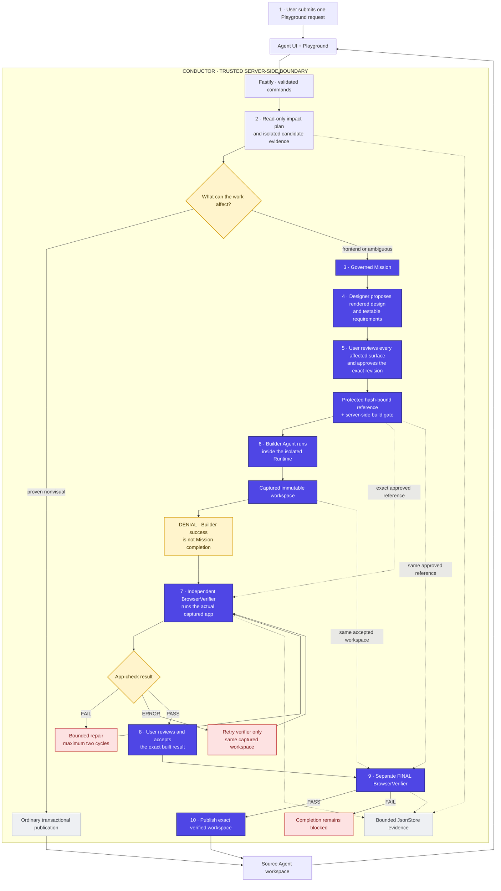

# Conductor architecture

Conductor keeps the Starter Kit's Agent frontend, Playground, Fastify control plane, JsonStore, workspace manager, and Agent Runner. The middleware decision and all authority-granting transitions stay server-side; React only presents state and sends explicit user actions.

## One-page architecture

The numbered purple path is the recorded demo. The gray branch is ordinary
nonvisual Playground work. Yellow diamonds and the Builder denial are the
authority gates; red nodes are bounded failure/recovery paths.

## What Conductor decides

The Playground remains the ordinary invocation surface. Conductor first plans impact without allowing authoritative writes. When execution is needed to resolve impact, it uses a disposable candidate workspace. The **complete actual candidate diff** is the final admission evidence:

- proven nonvisual work can publish transactionally back to the Agent without a Mission;
- frontend-affecting or ambiguous work cannot silently publish and is promoted into the governed Mission path.

This keeps ordinary backend/nonvisual work lightweight while protecting product-intent changes.

## Approval boundary

For governed work, the Designer can inspect the real application but its product proposal becomes authoritative only after Conductor validates and protects the exact DesignRevision.

The user reviews:

- the rendered affected surface(s);
- the acceptance requirements for those surfaces.

A deliberate approval action binds the exact protected revision. Merely visiting a surface does not count as review. Builder execution is denied server-side until the current protected revision is approved.

## Builder boundary

The Builder receives the approved reference as read-only input and works only in the Mission workspace. It cannot modify the protected reference or grant itself completion.

A successful Builder Agent Run is intentionally **non-terminal**. Conductor captures the resulting application as a bound workspace revision before verification.

This non-terminal success is the primary live denial shown in the TechJam demo: an Agent can claim success, but that claim does not authorize product adoption.

## Independent verification

The system-owned BrowserVerifier starts the actual captured application and evaluates the protected contract/reference at the same logical viewport.

It checks:

- required text and accessible elements;
- required interactions and expected observable results;
- runtime/console errors;
- bounded visual fidelity for contract-significant elements.

Visual fidelity is derived from browser-observable facts in the protected rendered reference and the real implementation, including bounded geometry, typography, and key color differences. The browser is only the measurement mechanism; the protected DesignRevision remains the source of truth.

This is deliberately **not** pixel-perfect screenshot equality, whole-DOM matching, or VLM judging. Small browser rendering drift can pass; material changes to protected elements fail verification.

## Adoption boundary

The first verification is a precheck. A PASS does not complete the Mission; it only allows the user to inspect the exact built result.

User acceptance is also non-terminal. A separate current final verifier run must PASS against the same approved design and captured implementation. Only then can Conductor transactionally publish that exact workspace back to the source Agent.

Final semantic FAIL denies completion. Verifier infrastructure ERROR is distinct and retryable against the same captured implementation without rerunning the Builder.

## Recovery and stale-result safety

Conductor keeps exact attempt/revision/workspace bindings and rejects stale or superseded authority results. Recovery is bounded and idempotent. Restart recovery does not automatically spend new model budget unless the accepted semantics explicitly authorize another model attempt.

Publication failure cannot invent success: the Agent remains reserved until the verified workspace is safely published or an explicit supported recovery action is taken.

Successful Agent publication resets unsafe stale ordinary Runtime thread context while preserving durable Playground Messages/Runs and the authoritative filesystem.

## Evidence and secrets

Conductor records bounded, redacted observable evidence such as:

- Run/action summaries;
- changed-file manifests;
- impact/admission evidence;
- design/revision hashes;
- verifier checks;
- reference/actual screenshots;
- correlations and recovery events.

It does not expose chain-of-thought, raw private reasoning, or provider credentials in Mission artifacts/events/UI.

## Deliberate scope

The POC is intentionally local and bounded. It has no arbitrary DAG/workflow builder, broker requirement, browser cloud, deployment platform, universal framework verifier, pixel/VLM judge, migration framework, production identity/RBAC, or retry-until-green repair loop.
